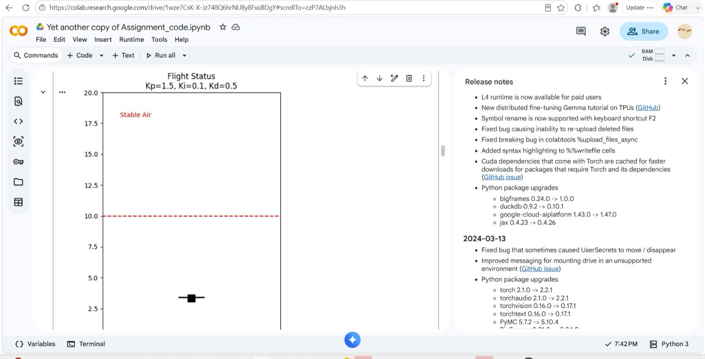
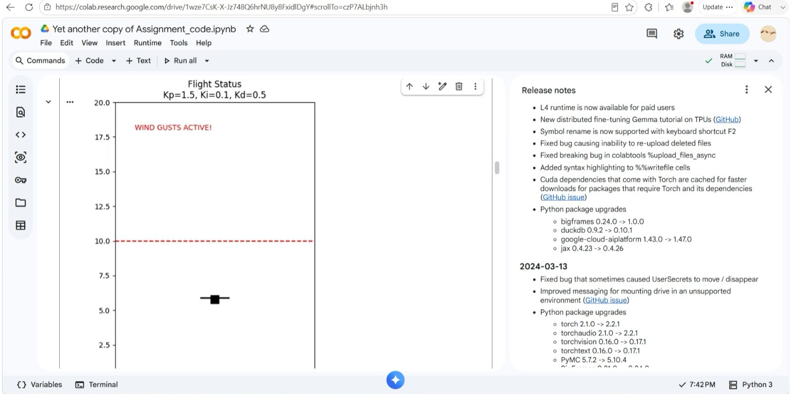
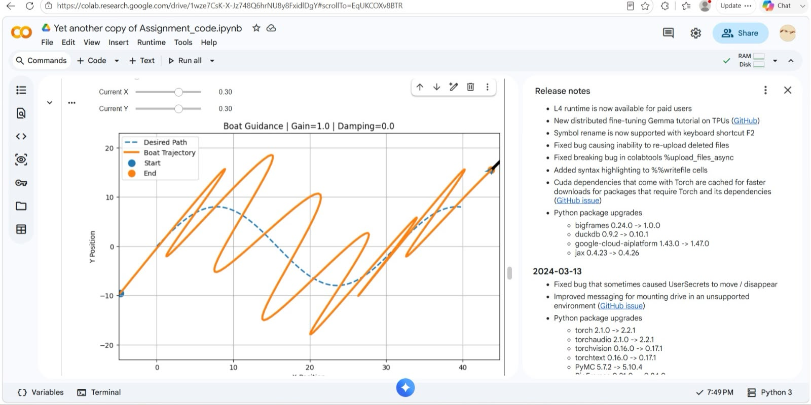
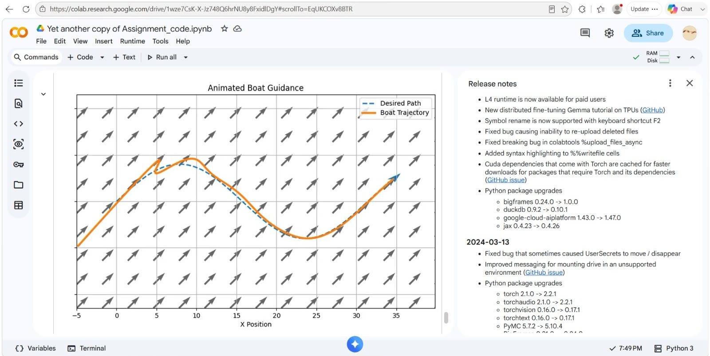

# 🚁 Drone Guidance and PID Control Simulation


---

## 📖 Overview

This project demonstrates **PID (Proportional–Integral–Derivative) control** for autonomous systems using Python simulations.

The notebook covers::

- 🚁 Drone altitude control
- 🌬️ Wind disturbance handling
- 🚤 Autonomous boat path tracking
- 📈 PID controller tuning
- 📊 Interactive visualizations

---

## 🛠️ Technologies Used

- Python
- NumPy
- Matplotlib
- Google Colab

---

# 📸 Simulation Results

### Flight Status

<p align="center">

</p>

---

### Flight Status with Wind Gust

<p align="center">

</p>

---

### Boat Guidance

<p align="center">

</p>

---

### Animated Boat Guidance

<p align="center">

</p>

---

## 📂 Repository Structure

```text
Drone-Guidance-and-PID-Control-Simulation/
│
├── Another_copy_of_Assignment_code.ipynb
├── README.md
└── images/
    ├── animatedboatguidance.jpeg
    ├── boatguidance.jpeg
    ├── flightstatus.jpeg
    └── flightstatuswindgust.jpeg
```

---

## ✨ Features

- PID Controller implementation
- Drone altitude stabilization
- Wind disturbance simulation
- Autonomous boat path tracking
- Real-time graphical visualization

---

## ▶️ How to Run

1. Clone the repository

```bash
git clone https://github.com/tejaswini101git/Drone-Guidance-and-PID-Control-Simulation.git
```

2. Open `Another_copy_of_Assignment_code.ipynb` in **Google Colab** or **Jupyter Notebook**.

3. Run all cells to reproduce the simulations.

---

## 📌 Output

The simulation demonstrates how a PID controller maintains stable flight, compensates for wind disturbances, and enables accurate path tracking for autonomous vehicles.

---

## 👩‍💻 Author

**M. Tejaswini**

B.Tech – Artificial Intelligence & Machine Learning

GitHub: https://github.com/tejaswini101git
